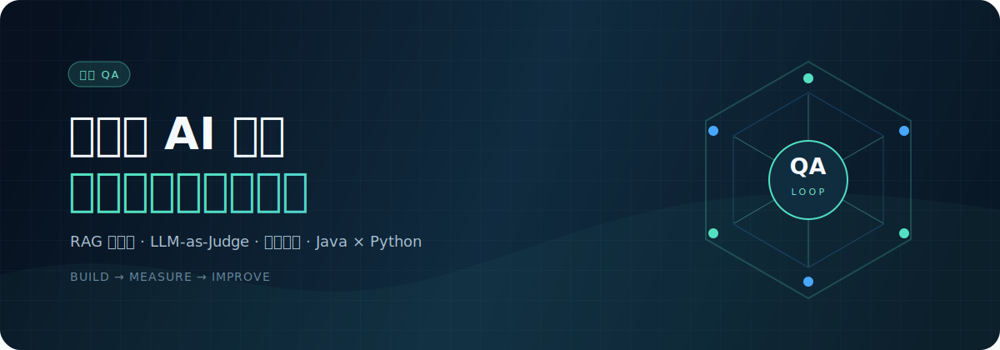
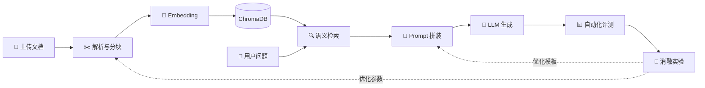
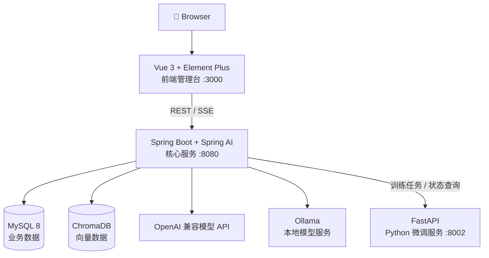

<div align="center">



### Enterprise AI Knowledge Base Platform

一套以 Java 为主干，把 **RAG、自动化评测与实验迭代** 串成闭环的全栈项目。

[从这里开始](#你能从这个项目带走什么) · [看看它怎么运转](#系统怎样运转) · [本地跑起来](#快速开始) · [开发笔记](QA项目文档/DEVELOPMENT.md)

</div>

---

## 我为什么做这个项目

最开始，我只是想把一条 RAG 链路跑通。真正写下去之后，问题很快就变了：文档应该怎么切？`TopK` 取多少？换一个 Prompt 到底有没有变好？一次回答看起来不错，并不能证明系统真的可靠。

所以有了「代号 QA」。它没有停在“上传文档然后聊天”，而是继续补上了测试集、LLM-as-Judge、消融实验和微调任务联动。这个仓库记录的是一套 AI 应用如何从 **能运行**，走到 **能衡量、能比较、能继续改进**。

## 你能从这个项目带走什么

| 学习主题 | 你会亲手完成 | 对应模块 |
| --- | --- | --- |
| **RAG 全链路** | 文档解析、滑动窗口分块、Embedding、向量检索、上下文拼接与答案生成 | 知识库、AI 问答 |
| **Prompt 工程** | 模板变量渲染、Few-shot、参数配置、版本归档与激活 | 提示词管理 |
| **大模型评测** | 构建测试集，用 LLM-as-Judge 评估相关性、忠实度与幻觉风险 | 自动化评测 |
| **实验方法** | 通过笛卡尔积组合对比 Chunk Size、TopK、Prompt 和模型 | 消融实验 |
| **全栈 AI 工程** | Spring AI 接入模型，Vue 构建管理端，Java 与 Python 服务协作 | 前后端、微调服务 |
| **部署与工程化** | 配置外部化、异步任务、统一异常处理、Swagger、Docker Compose 编排 | 基础设施 |

我更希望它是一张可以照着走的工程地图，而不是一份只能复制粘贴的答案。你可以只研究其中一段，也可以沿着完整闭环，把它改造成自己的知识库项目。

## 这套系统有什么不一样

- **回答只是起点**：一次问答结束后，还能进入测试、评分和对比实验。
- **参数变化看得见**：Chunk Size、TopK、Prompt 与模型都能进入消融实验，不再凭感觉调参。
- **Java 做业务编排，Python 做训练**：两个技术栈各自做擅长的事，通过 REST API 松耦合协作。
- **模型不是写死的**：使用 OpenAI 兼容协议，也保留 Ollama 本地模型路径。
- **适合顺着源码读**：从 Controller 到 Service，再到向量库和模型调用，主链路没有藏在黑盒里。

## 一句话介绍

**代号 QA** 是一个基于 Spring Boot、Spring AI 与 Vue 3 的知识库和 AI 效果实验台：文档进入向量库，问题经过检索后交给模型回答，答案再进入自动化评测和消融实验——把“感觉更好”变成有数据可看的“到底好在哪里”。

## 系统怎样运转



## 核心功能

| 模块 | 核心能力 | 学习重点 |
| --- | --- | --- |
| 📝 **提示词管理** | 模板 CRUD、变量渲染、模型参数、版本归档/激活 | Prompt 生命周期管理 |
| 📚 **知识库管理** | PDF/MD/TXT 上传、异步解析、分块与向量化 | RAG 数据处理管道 |
| 💬 **RAG 问答** | 语义检索、来源展示、SSE 流式响应、会话历史 | 检索增强生成链路 |
| 📊 **自动化评测** | 测试集、批量任务、客观指标、LLM 三维评分 | LLM-as-Judge 设计 |
| 🧪 **消融实验** | 多变量组合、批量执行、指标聚合、最优项标注 | AI 应用效果调优 |
| 🧬 **模型微调** | Java 调度 Python、LoRA 参数配置、状态轮询 | 异构服务协作 |

<details>
<summary><strong>展开查看评测指标</strong></summary>

- 检索精准度、上下文召回率：由 Java 计算客观指标。
- 答案相关性、上下文忠实度、幻觉风险：由 LLM 按 1–5 分评分。
- 任务级汇总：批量执行后聚合各项平均分，便于横向对比。

</details>

## 系统架构



### 技术栈

| 层级 | 技术选型 |
| --- | --- |
| 前端 | Vue 3、Vue Router、Vite、Element Plus、Axios |
| Java 后端 | Java 17、Spring Boot 3.4.5、Spring AI 1.0.0-M6、WebClient |
| 数据访问 | MyBatis-Plus 3.5.9、MySQL 8.0 |
| RAG 基础设施 | ChromaDB、Apache PDFBox 3.0.3、OpenAI 兼容 API / Ollama |
| Python 服务 | Python、FastAPI、Transformers、PEFT、QLoRA |
| 工程化 | Maven、SpringDoc OpenAPI、Nginx、Docker Compose |

## 快速开始

### 方式一：Docker Compose 一键启动（推荐）

你只需要准备 [Docker Desktop](https://www.docker.com/products/docker-desktop/) 或 Docker Engine + Compose。

```bash
git clone https://github.com/YuiHlk/Enterprise-AI-Knowledge-Base-Platform.git
cd Enterprise-AI-Knowledge-Base-Platform

# Linux / macOS
cp .env.example .env

# Windows PowerShell
Copy-Item .env.example .env
```

编辑 `.env`，至少配置可用的模型信息：

```env
AI_API_KEY=your-api-key
AI_BASE_URL=https://api.openai.com
AI_MODEL=gpt-4o-mini
EMBEDDING_MODEL=text-embedding-ada-002
```

启动全部服务：

```bash
# Linux / macOS
bash start.sh

# Windows
start.bat
```

| 服务 | 地址 | 用途 |
| --- | --- | --- |
| Web 管理端 | <http://localhost:3000> | 使用完整平台功能 |
| Swagger | <http://localhost:8080/swagger-ui.html> | 查看和调试后端 API |
| Python API | <http://localhost:8002/docs> | 查看微调服务接口 |
| ChromaDB | <http://localhost:8000> | 向量数据库服务 |

常用运维命令：

```bash
docker compose ps
docker compose logs -f backend
docker compose down
```

### 方式二：本地开发

本地开发需要 JDK 17+、Maven 3.8+、Node.js 18+ 与 Python 3.10+。

```bash
# 1. 启动基础设施
docker compose up -d mysql chromadb ollama

# 2. 启动 Java 后端
cd ai-java-main
mvn spring-boot:run

# 3. 在另一终端启动前端
cd ai-frontend
npm install
npm run dev

# 4. 可选：启动 Python 微调服务
cd python-train-side
pip install -r requirements.txt
uvicorn main:app --port 8002
```

> [!IMPORTANT]
> 请勿提交真实 API Key。`.env` 已被 Git 忽略，公开仓库中只保留 `.env.example`。

> [!NOTE]
> Python 微调服务默认提供可演示的任务流程与 QLoRA 训练骨架。执行真实 GPU 微调前，需要按 `python-train-side/requirements.txt` 的说明安装 PyTorch、Transformers、PEFT、BitsAndBytes 等依赖，并准备合适的 GPU 环境与数据集。

## 推荐学习路线

1. **先运行平台**：上传一份文档，体验知识库问答与答案来源。
2. **读懂 RAG 主链路**：从 `DocumentService`、`TextChunkService`、`EmbeddingService` 读到 `RetrievalService` 与 `QAService`。
3. **理解 Prompt 工程**：观察模板变量如何渲染，以及不同版本如何被激活和归档。
4. **建立评测集**：为同一批问题执行自动化评测，理解相关性、忠实度与幻觉指标。
5. **运行消融实验**：改变 Chunk Size、TopK 或 Prompt 版本，比较指标变化。
6. **扩展自己的能力**：接入新模型、重排器、混合检索，或把模拟微调替换为真实训练任务。

## 项目结构

```text
Enterprise-AI-Knowledge-Base-Platform/
├── ai-java-main/          # Spring Boot 核心服务：RAG、评测、实验与任务编排
├── ai-frontend/           # Vue 3 管理端：7 个业务工作区
├── python-train-side/     # FastAPI 微调子服务与 QLoRA 训练骨架
├── QA项目文档/             # 开发指南、项目总结与学习笔记
├── docker-compose.yml     # MySQL、ChromaDB、Ollama 与应用服务编排
├── start.sh               # Linux / macOS 启动脚本
├── start.bat              # Windows 启动脚本
└── .env.example           # 环境变量模板
```

## 延伸阅读

- [开发指南](QA项目文档/DEVELOPMENT.md)：环境搭建、API 参考、编码规范与常见问题。
- [项目总结](QA项目文档/PROJECT_SUMMARY.md)：各阶段成果、设计思路与技术债务。
- [项目全景分析](QA项目文档/QA项目文档/项目全景分析.md)：更深入的模块与源码说明。
- [AI 应用面试题与参考答案](QA项目文档/QA项目文档/AI应用开发实习生-面试题与标准答案.md)：用问题检验学习成果。

## 接下来还想做什么

- [ ] Spring Security + JWT 多用户与权限体系
- [ ] BM25 + 向量检索 + Reranker 混合检索
- [ ] Redis 任务队列与训练状态持久化
- [ ] MinIO / OSS 文档对象存储
- [ ] Prometheus + Grafana 可观测性
- [ ] GitHub Actions 自动测试与镜像构建
- [ ] 更完整的单元测试、集成测试与 RAG 评测基准

## 一起完善它

欢迎提交 Issue 分享你的学习问题、功能建议或 Bug，也欢迎通过 Pull Request 补充新的模型适配、检索策略、评测指标和学习笔记。

如果这个项目对你的学习有帮助，欢迎点一个 ⭐ Star，让更多正在学习 AI 应用工程的人看到它。

---

<div align="center">

**Build a RAG system. Measure it. Improve it.**

</div>
